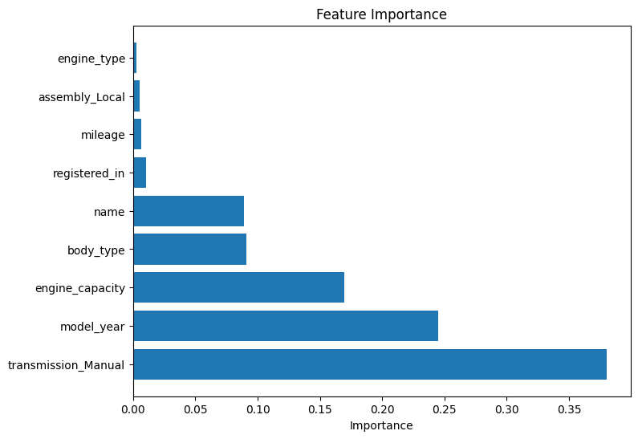

# Car_sales_analysis_and_forecasting
This project aims to predict used car prices based on their technical and categorical features. A clean dataset was preprocessed, log-transformed, and used to train regression models with attention to feature reliability and leakage prevention.

## Overview

The dataset contains listings of used cars with attributes such as engine type, capacity, body type, model year, and mileage.  
After cleaning and encoding the data, a regression model was trained on the log-transformed price to reduce variance and improve stability.

The main steps are:
1. Data preprocessing (cleaning, encoding, transformations)
2. Model training and evaluation
3. Visual diagnostics
4. Feature importance analysis

---

## Visualizations

### 1. Actual vs Predicted Prices
Shows how close the predicted prices are to the real ones.


### 2. Residuals vs Predicted
Used to check whether model errors depend on the predicted value.


### 3. Distribution of Relative Residuals
Displays how often different relative errors occur.


### 4. Feature Importance
Shows which features have the strongest impact on predicted prices.



### 5. Results

The final model achieved **R² = 0.91** on the test set, showing strong predictive performance.  
Predicted price ranges and residual analysis indicate that the model generalizes well and captures the main price patterns in the dataset.

Feature importance analysis showed that **transmission type**, **model year**, and **engine capacity** were the most influential factors.


## Installation

To run this notebook, install the required packages:

```bash
pip install -r requirements.txt
